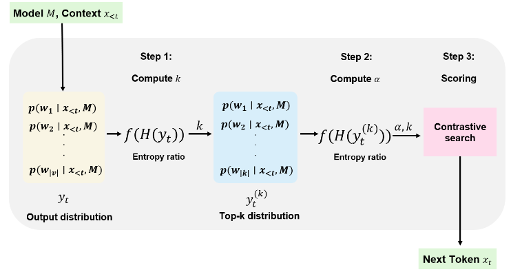
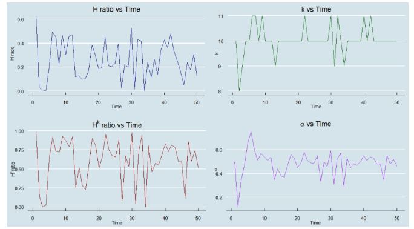

## Adaptive Contrastive Search: Uncertainty-Guided Decoding for Open-Ended Text Generation (ACS) <br><sub>Official PyTorch Implementation</sub>
### [Paper](https://arxiv.org/pdf/2407.18698v1) | Run Adaptive Contrastive Search Demo [](https://colab.research.google.com/drive/1E5BYz9S9JatnJsreDWEpvwEaJGqOYb6w) 



This repo contains PyTorch model definitions, sampling codes and evaluation codes for our paper Adaptive Contrastive Search: Uncertainty-Guided Decoding for Open-Ended Text Generation (ACS). You can find more technique details in our [paper](https://arxiv.org/pdf/2407.18698v1).

> [**Adaptive Contrastive Search: Uncertainty-Guided Decoding for Open-Ended Text Generation**](https://arxiv.org/pdf/2407.18698v1)<br>
> [Esteban Garces Arias](https://scholar.google.com/citations?user=FK1UX0gAAAAJ&hl=es), [Julian Rodemann](https://rodemann.github.io/), [Meimingwei Li](https://scholar.google.com/citations?user=FpT8ECwAAAAJ&hl=en&oi=ao), [Christian Heumann](https://scholar.google.de/citations?user=H6LdyzoAAAAJ&hl=de),[Matthias Aßenmacher](https://assenmacher-mat.github.io/)
> <br>Department of Statistics, LMU Munich, Munich Center for Machine Learning (MCML)<br>

In this study, we introduce adaptive contrastive search, a novel decoding strategy extending contrastive search by incorporating an adaptive degeneration penalty, guided by the estimated uncertainty of the model at each generation step. This strategy is designed to enhance both the creativity and diversity of the language modeling process while at the same time producing coherent and high-quality generated text output. Our findings indicate performance enhancement in both aspects, across different model architectures and datasets, underscoring the effectiveness of our method in text generation tasks. Our code base, datasets, and models are publicly available.

This repository contains:

* 🪐 A simple PyTorch [implementation](story_generation/adaptive_contrastive_search.py) of Adaptive Contrastive Search
* ⚡️ Faster Metrics Calculation with [Coherence](measure_coherence.py), [MAUVE and Diversity](measure_mauve_gene_length_diversity.py)
* 💥 A [Colab notebook](https://colab.research.google.com/drive/1E5BYz9S9JatnJsreDWEpvwEaJGqOYb6w) for running Adaptive Contrastive Search Demo in colab

<a id="top"></a>
## Repository Contents 📖

- [Environment Setup](#environment-setup-)
- [Dataset Information](#dataset-information-)
- [Generation Baselines](#baselines-)
- [Metrics Evaluation (MAUVE, Diversity, Coherence)](#metric-evaluation)
- [Human Evaluation](#human-evaluation-)

## Environment Setup <a name="environment-setup-"></a> 🚀 <a href="#top">[Back to Top]</a>
First, download and set up the repo:
```bash
git clone https://github.com/YecanLee/Adaptive-Contrastive-Search
cd Adaptive-Contrastive-Search
```

We provide an [`environment.yml`](environment.yml) file that can be used to create a Conda environment. 

```bash
conda env create -f environment.yml
conda activate acs
```

If you prefer not to use Conda, you can install the dependencies using pip.
```bash
pip install -r requirements.txt
```

If you want to use `flash-attention`, you may need to install `cuda-toolkit` by yourself if it is not already installed.
```bash
conda install nvidia/label/cuda-12.2.0::cuda-toolkit
pip install ninja packaging flash-attn
```
You can find the specific version of `cuda-toolkit` that is compatible with your GPU from [here](https://anaconda.org/nvidia/cuda-toolkit).
****

<span id='data'/>

## Dataset Information <a name="benchmark-data-"></a> <a href="#top">[Back to Top]</a>

We used two different datasets for performance comparison in the paper. The first dataset is the English dataset in the `data` folder, which contains `wikitext`, `wikinews` and `book` files. The second dataset is the `multilingual` dataset, which contains 15 different language files.

To check the details for each dataset, please check the [data/README.md](data/README.md) and [multilingual_data/README.md](multilingual_data/README.md).

## Generation Baselines <a name="baselines-"></a> <a href="#top">[Back to Top]</a>
## Sampling Quick Start Demo [](http://colab.research.google.com/github/facebookresearch/DiT/blob/main/run_DiT.ipynb)
   

> **** The following part is the `static contrastive search` baseline model from our paper for performance comparision::****   

You can run the story generation baseline with [static contrastive search paper](https://arxiv.org/abs/2210.14140) method by running [static_contrastive_base.py](story_generation/static_contrastive_base.py). The script has various arguments to switch between different datasets, adjust penalty alpha and k value, change the generation result saving path, etc. For example, to sample from `wikitext` dataset with `k=10` and `alpha=0.6`, you can use:

```bash
python story_generation/static_contrastive_search.py \
--config_path configs/contrastive_base.yaml \
--model_name gpt2-xl \
--save_path_prefix wikitext_CS \
--k 10 \
--alpha 0.6 \
--dataset wikitext 
```

> **** The following part is our proposed `adaptive contrastive search` method baseline model from our paper::****   

You can run the story generation baseline with our proposed [adaptive contrastive search](https://arxiv.org/pdf/2407.18698v1) method by running [adaptive_contrastive_base.py](story_generation/adaptive_contrastive_base.py). This script also has various arguments to switch between different datasets, adjust penalty alpha and k value **starting value**, change the generation result saving path, etc. For example, to sample from `wikitext` dataset with `q=8` and `alpha=0.6` as starting value, you can run:

```bash
python story_generation/adaptive_contrastive_search.py \
--config_path configs/adaptive_contrastive_base.yaml \
--q 8  \
--dataset wikitext \
--save_path_prefix wikitext_ACS \
--k 10 
```
 
To reproduce the results in the paper, you can change the flag `--q` for different experiment settings. Change the `--dataset` to one of `wikitext, wikinews, book`.   
You can also change the flag `--k` if you want the `ACS` strategy to be initialized from a different `k`.     
If you only want to test generating with several samples, please change the `--data_num` flag into your preferred value. The default setting will use the whole dataset for generation.

### Enhancements
Generation could likely be speed-up by:
- [x] using [Flash Attention](https://github.com/HazyResearch/flash-attention) in the generation scripts, please check the [Environment Setup](#environment-setup-) section for more details.
- [x] using `torch.compile` in PyTorch 2.0, we implemented this by using `max_autotune` mode in the generation scripts, you may need to modify the `torch.compile` codes to fit your needs.  

**TF32 Note (important for Ampere, Hopper, and other recent NVIDIA GPUs users).**    
When we ran the above generation scripts, TF32 matmuls were disabled per PyTorch's defaults.    
We've enabled them at the top of `static_contrastive_base.py` and `adaptive_contrastive_base.py` because it makes sampling way way way faster on 
those GPUs, but note that the use of TF32 may lead to some differences in the results. Those differences are likely to be negligible for most comparison purposes.

## Metrics Evaluation (MAUVE, Diversity, Coherence) <a name="metric-evaluation"></a> <a href="#top">[Back to Top]</a>
We provide the scripts for calculating the metrics score for `MAUVE`, `diversity` and `coherence`. `MAUVE` score is calculated by using the [mauve-text](https://github.com/krishnap25/mauve) package. `diversity` score is calculated by using the same `n-gram` diversity method mentioned in [contrastive search paper](https://arxiv.org/pdf/2211.10797). `coherence` score is calculated by using method mentioned in [coherence paper](https://arxiv.org/abs/2210.14140).

To calculate the metrics score for `MAUVE`, `diversity` and `coherence`, please run the following commands:
```shell
cd scripts/

# Compute the coherence score
measure_coherence.sh YOUR_GENERATION_RESULT_PATH

# Compute the MAUVE and diversity
measure_mauve.sh YOUR_GENERATION_RESULT_PATH
```

**TF32 Note (important for Ampere, Hopper, and other recent NVIDIA GPUs users).**   
Our coherence score calculation script uses TF32 for faster computation, which may lead to some super small differences in the results. 

## Human Evaluation Result <a name="human-evaluation-"></a> <a href="#top">[Back to Top]</a>
To check the human evaluation result reported in the paper, please check the `Human_Evaluation_Results.xlsx` file. 

## BibTeX 

```bibtex
@article{garces2024adaptive,
  title={Adaptive Contrastive Search: Uncertainty-Guided Decoding for Open-Ended Text Generation},
  author={Garces Arias, Esteban and Rodemann, Julian and Li, Meimingwei and Heumann, Christian and A{\ss}enmacher, Matthias},
  journal={arXiv e-prints},
  pages={arXiv--2407},
  year={2024}
}
```


## Acknowledgments
We wish to express our gratitude to Daniele Pugno and Nicolò Campagnoli for their technical support and visualizations. Matthias Aßenmacher
received funding from the Deutsche Forschungsgemeinschaft, Julian Rodemann acknowledges support by the Federal Statistical Office of Germany as well as by the Bavarian Institute for Digital Transformation (bidt) and the Bavarian Academy of Sciences (BAS).    
The codebase borrows from [Contrastive_Search_versus_Contrastive_Decoding](https://github.com/yxuansu/Contrastive_Search_versus_Contrastive_Decoding) repository. We also thank the authors for their open-sourcing the codes.


## License
See [`LICENSE.txt`](LICENSE.txt) for details.